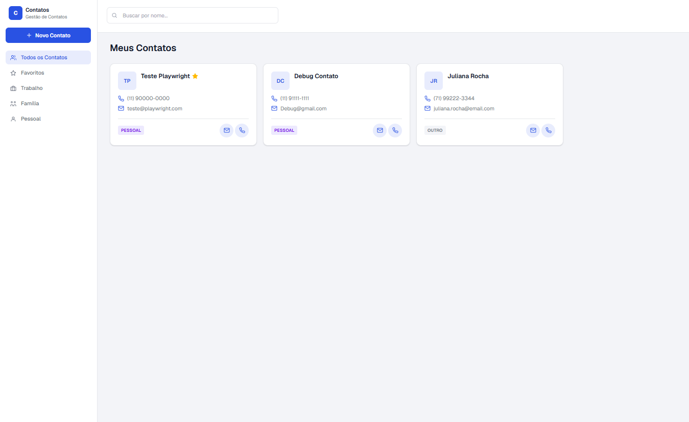
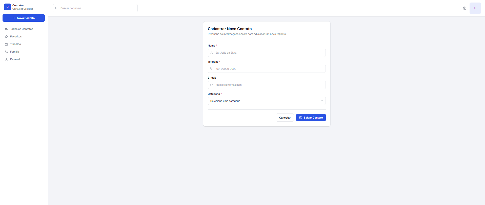
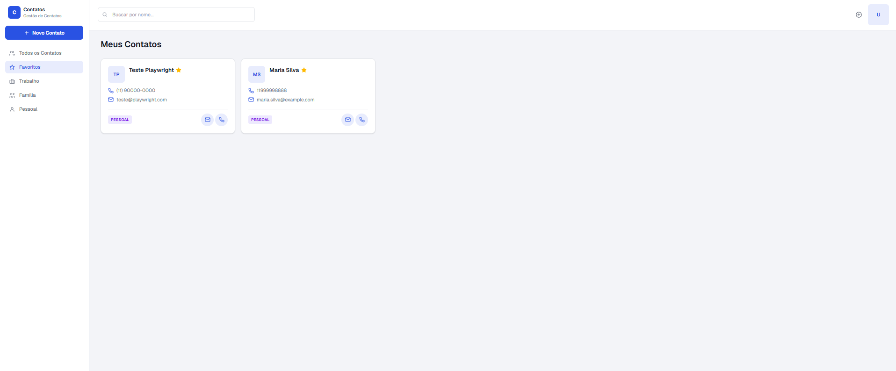
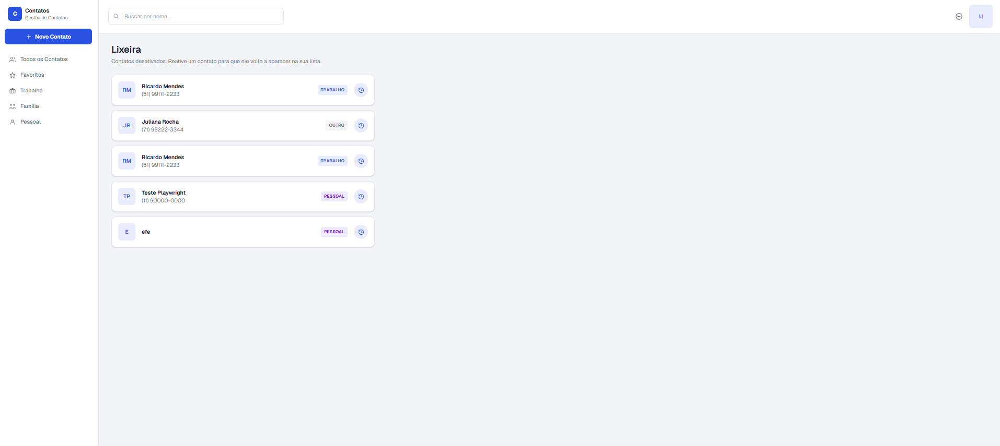
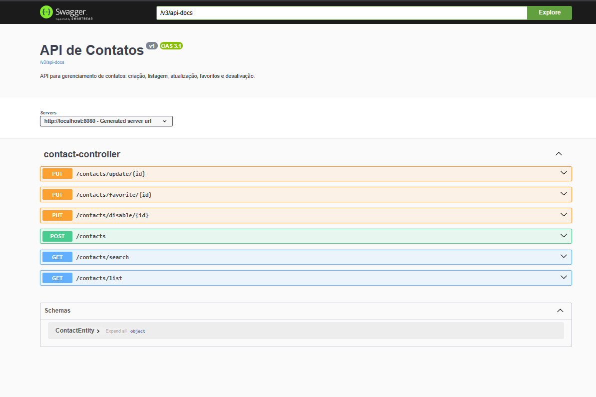

# Desafio 1 — Gerenciador de Contatos Pessoais

> Nível: Iniciante
> Stack: Backend Java + Spring Boot | Frontend Next.js | PostgreSQL

Aplicação simples de agenda de contatos pessoais, onde o usuário cadastra, edita, visualiza e inativa contatos. Serve como base para fixar CRUD completo fullstack.

Detalhes do enunciado e requisitos: [desafio1.md](desafio1.md)

## Stack

### Backend (`contatos/`)

- Java 21 + Spring Boot 4.1.0
- Spring Data JPA
- PostgreSQL (driver runtime)
- Lombok

### Frontend (`frontend/`)

- Next.js 16.2.12 (App Router)
- React 19.2.4
- TypeScript
- Tailwind CSS 4

### Banco de dados

- PostgreSQL via Docker Compose

## Funcionalidades

- Cadastro de novo contato (nome, telefone, e-mail, categoria)
- Listagem de contatos ativos
- Edição de contato existente
- Inativação de contato (soft delete — sem exclusão permanente)
- Busca de contato por nome (parcial, case-insensitive)
- Favoritar contato

Categorias disponíveis: `PERSONAL`, `WORK`, `OTHER`.

## Como rodar

### 1. Banco de dados

Na raiz do desafio (`desafrio-contatos-1/`):

```bash
docker compose up -d
```

Isso sobe um PostgreSQL na porta `5432` (usuário `admin`, senha `admin`, database `gestao_contatos`).

### 2. Backend

```bash
cd contatos
./mvnw spring-boot:run
```

A API sobe por padrão em `http://localhost:8080`.

Principais endpoints (`/contacts`):

| Método | Rota | Descrição |
| --- | --- | --- |
| POST | `/contacts` | Cria um novo contato |
| GET | `/contacts/list` | Lista contatos ativos |
| GET | `/contacts/search?name=` | Busca contatos por nome |
| PUT | `/contacts/update/{id}` | Atualiza um contato |
| PUT | `/contacts/disable/{id}` | Inativa um contato (soft delete) |
| PUT | `/contacts/favorite/{id}` | Alterna o status de favorito do contato |

### 3. Frontend

```bash
cd frontend
npm install
npm run dev
```

A aplicação sobe por padrão em `http://localhost:3000`.

### 4. Documentação da API (Swagger)

Com o backend rodando, a documentação interativa (OpenAPI) fica disponível em:

```text
http://localhost:8080/swagger-ui/index.html
```

## Prints

**Listagem de contatos**
Tela inicial com os contatos ativos, exibidos em cards com nome, telefone, e-mail e categoria. A busca por nome e a navegação por categoria (Favoritos, Trabalho, Família, Pessoal) ficam na barra lateral.


**Cadastro de contato**
Formulário de criação de contato com validação dos campos obrigatórios (nome, telefone e categoria) e campo opcional de e-mail.


**Favoritos**
Filtro "Favoritos" da barra lateral exibindo apenas os contatos marcados com estrela.


**Lixeira**
Contatos inativados (soft delete) listados na lixeira, com botão para reativar cada um e voltar a exibi-lo na listagem principal.


**Documentação da API (Swagger)**
Documentação interativa dos endpoints REST do `contact-controller` (criação, listagem, busca, atualização, favoritar e desativar), gerada via springdoc-openapi.

